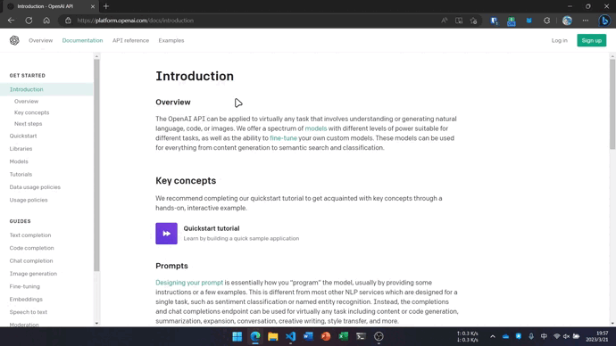
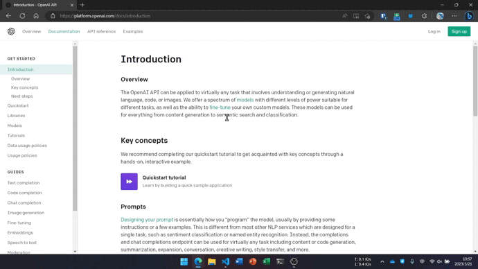
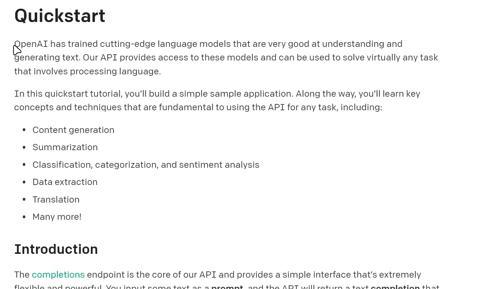

<div align="center">
    
    <h3 align="center" style="font-size:50px"><b>Pot</b></h3>
    <p align="center" style="font-size:18px">一个跨平台的划词翻译软件</p>
    <a href="https://pot.pylogmon.cn/guide/">快速上手</a> |
    <a href="https://github.com/Pylogmon/pot/releases">软件下载</a> |
    <a href="https://pot.pylogmon.cn/guide/config.html">进阶配置</a>
    
</div>
<div align="center">

[](https://github.com/Pylogmon/pot/releases)
[](https://github.com/Pylogmon/pot/releases)
[](https://github.com/Pylogmon/pot/blob/main/LICENSE)
[](https://github.com/Pylogmon/pot/actions/workflows/package.yml)


[](https://aur.archlinux.org/packages/pot-translation)
[](https://aur.archlinux.org/packages/pot-translation-bin)
[](https://aur.archlinux.org/packages/pot-translation-git)

</div>
<hr/>

## 支持平台

|   |Linux|Windows|MacOS|
| - |-----|-------|-----|
|划词翻译|✅|✅|✅|
|独立窗口|✅|✅|✅|
|插件调用| |[SnipDo](https://www.microsoft.com/store/productId/9NPZ2TVKJVT7)|[PopClip](https://pilotmoon.com/popclip/)|

## 支持接口
- [x] 有道翻译(无需申请)
- [x] Open AI(需要申请 [api服务](https://pot.pylogmon.cn/guide/api/) 0.002$/1000token)
- [x] 百度翻译(需要申请 [api服务](https://pot.pylogmon.cn/guide/api/) 每月免费额度100万字符)
- [x] 彩云小译(需要申请 [api服务](https://pot.pylogmon.cn/guide/api/) 每月免费额度100万字符)
- [x] 腾讯翻译(需要申请 [api服务](https://pot.pylogmon.cn/guide/api/) 每月免费额度500万字符)
- [x] 火山翻译(需要申请 [api服务](https://pot.pylogmon.cn/guide/api/) 每月免费额度200万字符)
- [x] 谷歌翻译(无需申请，但需要自己解决网络问题，已提供镜像站地址设置选项)
- [x] DeepLX(需要自己设置deeplx服务，参考[OwO-Network/DeepLX](https://github.com/OwO-Network/DeepLX))

具体的api服务申请，请看[申请指南](https://pot.pylogmon.cn/guide/api/)
> 由于使用api产生的费用本作者概不负责
## 参与贡献
参考 [接口贡献指南](./CONTRIBUTING.md)

## 安装
### Linux
#### Debian
在 [Release](https://github.com/Pylogmon/pot/releases) 下载最新deb包安装

> **注意：低版本系统请下载 `pot_<version>_amd64_universal.deb` 否则会因为`glibc`版本过低无法运行**

#### Arch
已提供 [AUR](https://aur.archlinux.org/packages?O=0&K=pot-translation) 包

#### 关于Wayland
由于tauri的全局快捷键暂时还不支持Wayland,所以现在有两种解决办法：
1. 虽然本软件依赖于X11，但是得益于xwayland，实测wayland下通过`GDK_BACKEND=x11`启动是可以正常使用的。
2. 最新版本已经支持了命令行参数，可以在设置中将快捷键留空，然后在系统设置中设置自定义快捷键（需要软件保持后台运行）
    ```bash
    pot translate # 划词翻译
    pot persistent # 独立窗口
    ```

### Windows
#### WinGet
pot 已经进入了winget仓库，可以直接使用winget安装
```powershell
winget install Pylogmon.pot
```
#### 手动安装
在 [Release](https://github.com/Pylogmon/pot/releases) 下载最新msi安装包安装

## 使用方法
| 方式 | 描述 | 预览 |
| :---: | :---: | :---: |
| 划词翻译 | 选中需要翻译的文本之后，按下划词翻译快捷键即可（默认 `Ctrl + D`） |  |
| 输入翻译| 按下输入翻译快捷键（默认 `Ctrl + Shift + D`），输入需要翻译的文本，`Enter` 键翻译 |  |
| 插件调用 | 选中需要翻译的文本之后，点击插件图标即可，详情见 [插件调用](https://pot.pylogmon.cn/guide/config.html#%E6%8F%92%E4%BB%B6%E8%B0%83%E7%94%A8) |  |

## 感谢

- [Bob](https://github.com/ripperhe/Bob) 灵感来源
- [bob-plugin-openai-translator](https://github.com/yetone/bob-plugin-openai-translator) OpenAI接口参考
- [@uiYzzi](https://github.com/uiYzzi) 提供实现思路
- [Tauri](https://github.com/tauri-apps/tauri) 好用的Gui框架