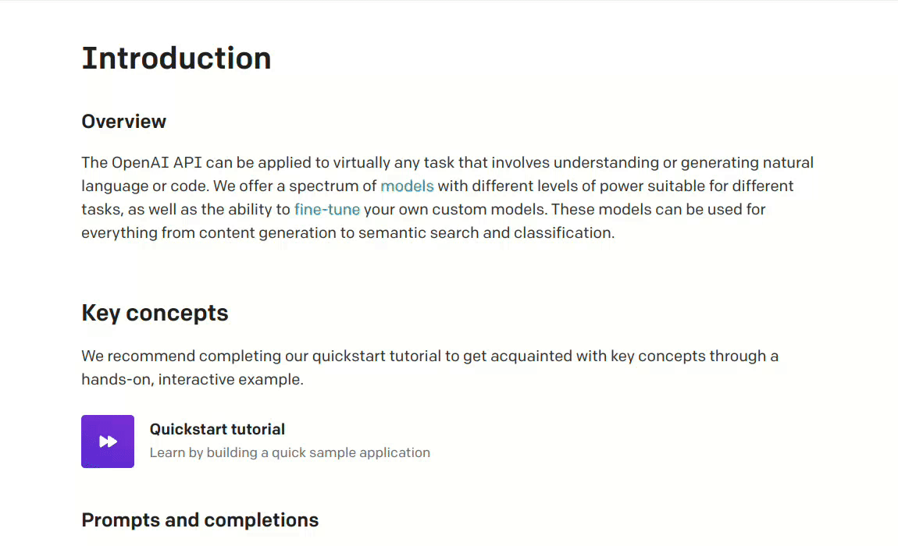

<div align="center">
    
    <h3 align="center" style="font-size:50px"><b>Pot</b></h3>
    <p align="center" style="font-size:18px">一个跨平台的划词翻译软件</p>
    <hr>
</div>

## 支持平台

|   |Linux|Windows|MacOS|
| - |-----|-------|-----|
|划词翻译|✅| | |
|独立窗口|✅|✅|✅|

## 支持接口
- [x] 有道翻译(免费)
- [x] ChatGPT(参考自[@yetone](https://github.com/yetone)大佬的[bob-plugin-openai-translator](https://github.com/yetone/bob-plugin-openai-translator))
- [ ] 百度翻译
- [ ] 火山翻译
- [ ] 腾讯翻译
- [ ] 谷歌翻译
- [ ] DeepL
- [ ] 有道翻译
- [ ] 彩云小译
- [ ] 阿里翻译

## 使用截图


## 使用方法
1. 鼠标选择需要翻译的内容
2. 按下划词翻译快捷键（默认Ctrl+D）
3. 完成翻译

## 安装

### Debian
在 [Release](https://github.com/Pylogmon/pot/releases) 下载最新deb包安装

### Deepin
Deepin V20 请下载 `pot_<version>_amd64_deepin.deb` 安装

### Arch
安装 [AUR](https://aur.archlinux.org/packages/pot-translation) 的 `pot-translation`包

## 手动编译

### 所需工具
- rust 1.67.0
- pnpm
- nodejs 19
### 编译步骤

1. 克隆仓库
```bash
git clone https://github.com/Pylogmon/pot.git
```

2. 安装构建依赖
```bash
sudo apt-get install -y libgtk-3-dev libwebkit2gtk-4.0-dev libappindicator3-dev librsvg2-dev patchelf
```

3. 开始编译
```bash
cd pot

pnpm install # 安装前端依赖

pnpm tauri build # 编译打包
```

## 感谢

- [Bob](https://github.com/ripperhe/Bob) 软件的灵感
- [bob-plugin-openai-translator](https://github.com/yetone/bob-plugin-openai-translator) 项目的启发
- [@uiYzzi](https://github.com/uiYzzi) 提供的实现思路
- [Tauri](https://github.com/tauri-apps/tauri) 提供的好用的开发框架