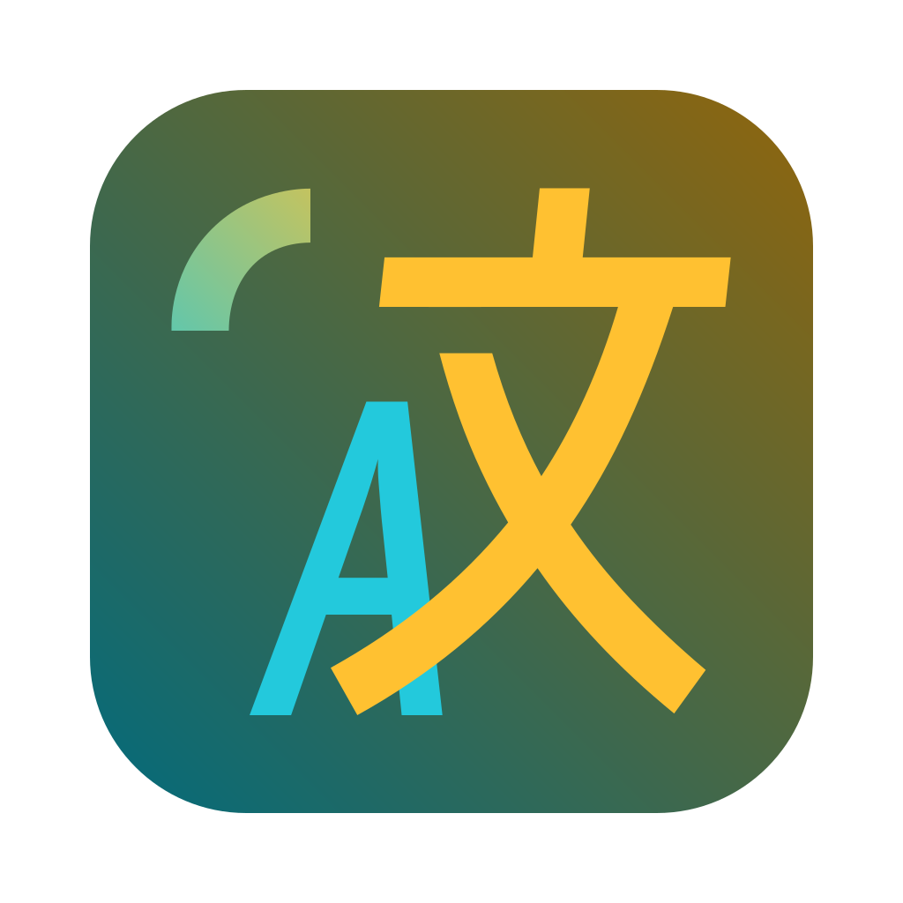
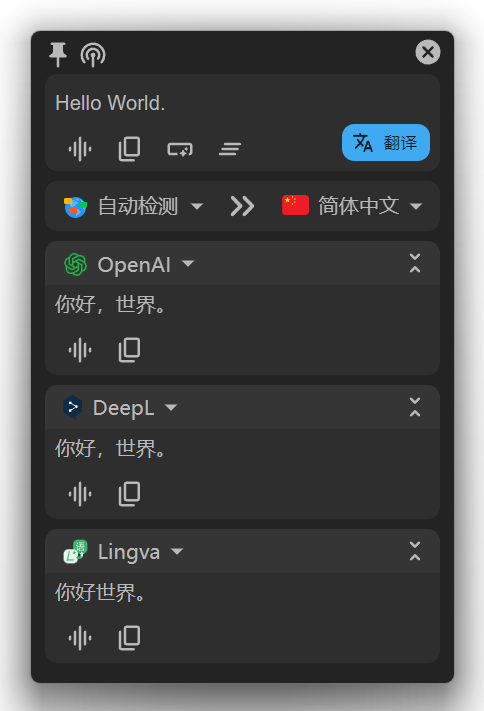
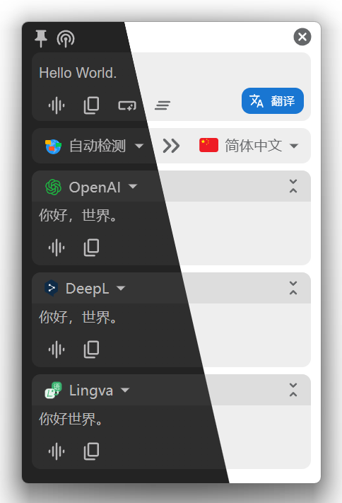
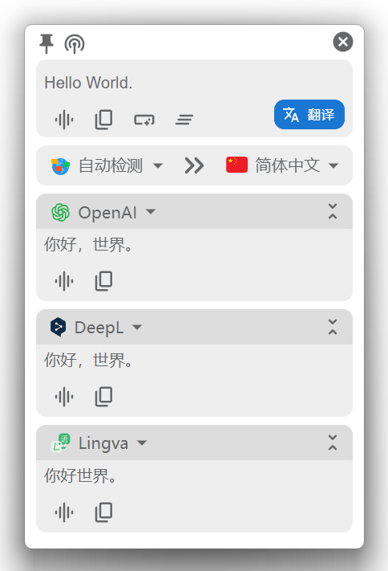
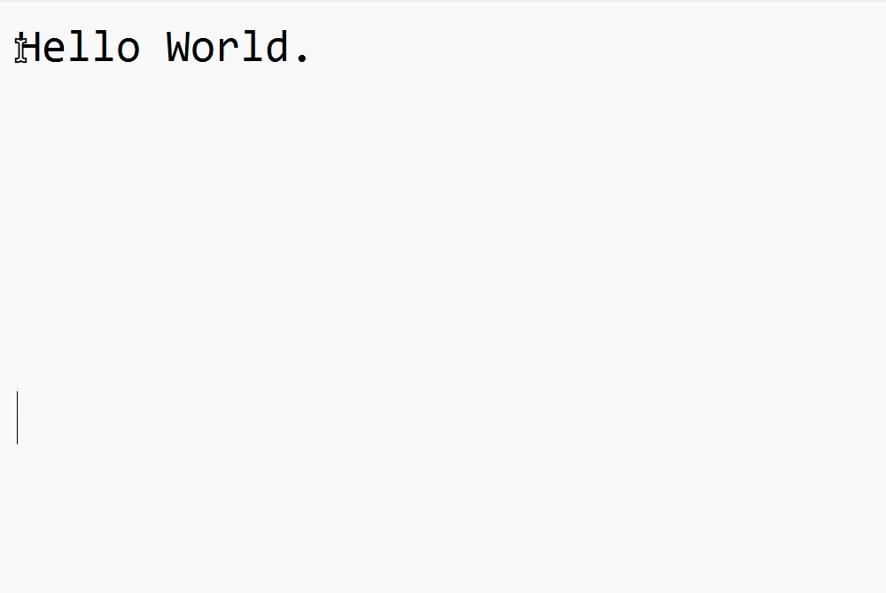
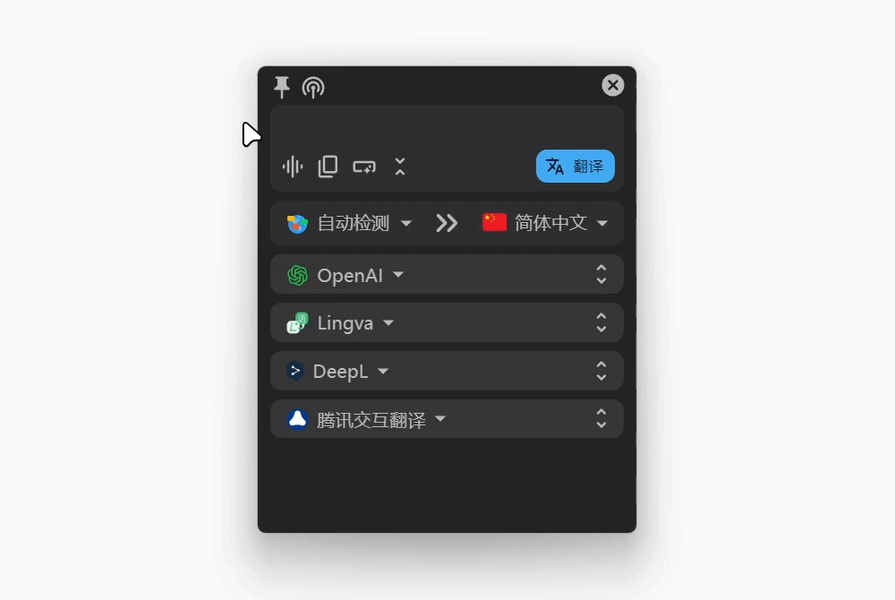
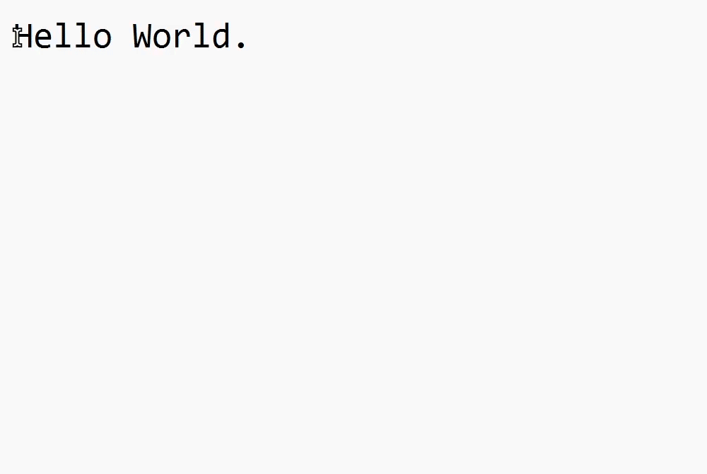
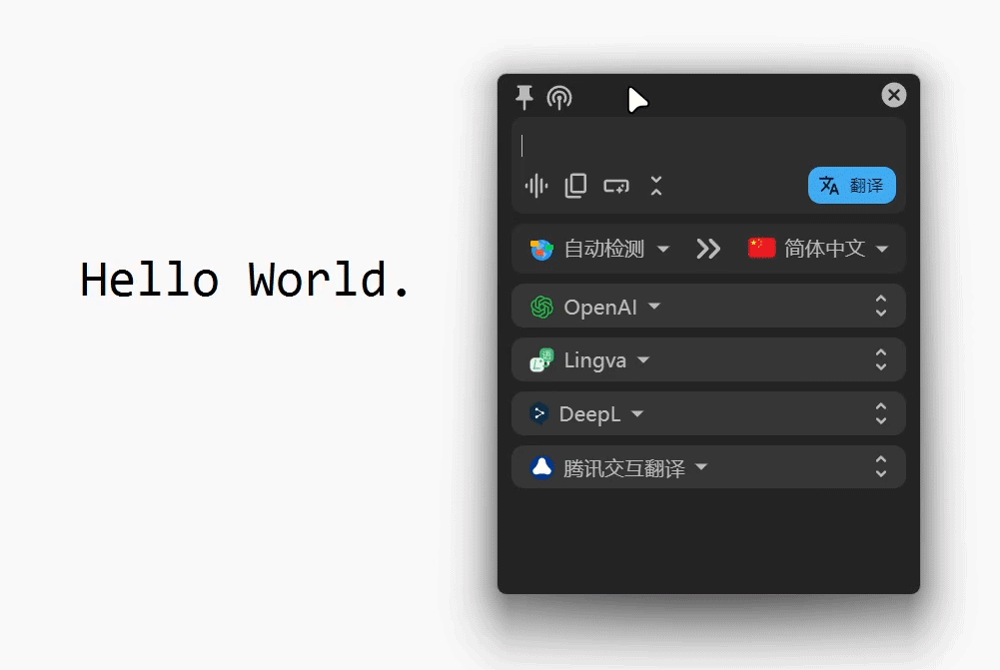
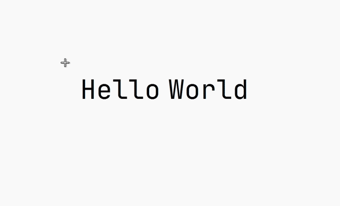
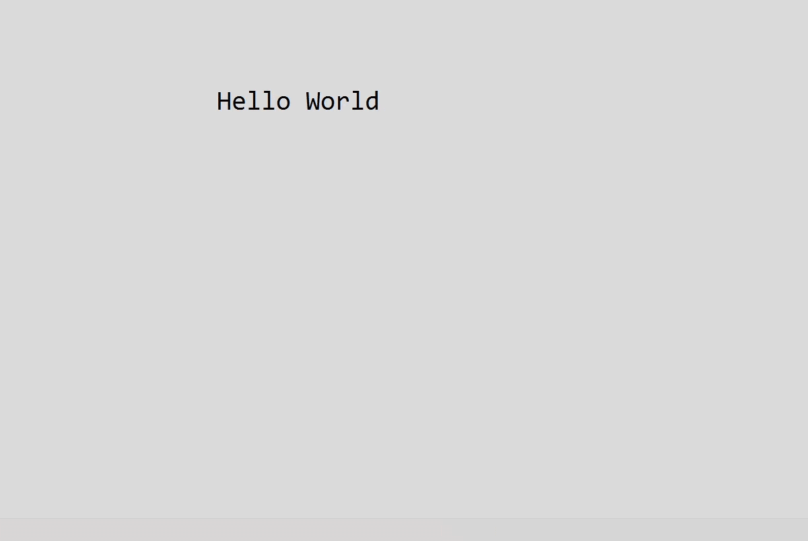

# Pot (派了个萌的翻译器)

> 🌈 一个跨平台的划词翻译软件 ([QQ 频道](https://pd.qq.com/s/akns94e1r))


<br/>
<hr/>
<div align="center">

<h3>中文 | <a href='./README_EN.md'>English</a> | <a href='./README_KR.md'> 한글 </a></h3>

<table>
<tr>
    <td> 
    <td> 
    <td> 
</table>

# 目录

</div>

-   [使用说明](#使用说明)
-   [特色功能](#特色功能)
-   [支持接口](#支持接口)
-   [插件系统](#插件系统)
-   [安装指南](#安装指南)
-   [外部调用](#外部调用)
-   [Wayland 支持](#wayland-支持)
-   [国际化](#国际化weblate)
-   [贡献者](#贡献者)
-   [感谢](#感谢)

<div align="center">

# 使用说明

| 划词翻译                                             | 输入翻译                                                       | 外部调用                                                             |
| ---------------------------------------------------- | -------------------------------------------------------------- | -------------------------------------------------------------------- |
| 鼠标选中需要翻译的文本，按下设置的划词翻译快捷键即可 | 按下输入翻译快捷键呼出翻译窗口，输入待翻译文本后按下 回车 翻译 | 通过被其他软件调用实现更加方便高效的功能, 详见 [外部调用](#外部调用) |
|                            |                                      |                                            |

| 剪切板监听模式                                                         | 截图 OCR                                          | 截图翻译                                         |
| ---------------------------------------------------------------------- | ------------------------------------------------- | ------------------------------------------------ |
| 在任意翻译面板上点击左上角图标启动剪切板监听默认，复制文字即可完成翻译 | 按下截图 OCR 快捷键后框选需要识别区域即可完成识别 | 按下截图翻译快捷键后框选需要识别区域即可完成翻译 |
|                                              |                         |                        |

</div>

<div align="center">

# 特色功能

</div>

-   [x] 多接口并行翻译 ([支持接口](#支持接口))
-   [x] 多接口文字识别 ([支持接口](#支持接口))
-   [x] 多接口语音合成 ([支持接口](#支持接口))
-   [x] 导出到生词本 ([支持接口](#支持接口))
-   [x] 外部调用 ([详情](#外部调用))
-   [x] 支持插件系统 ([插件系统](#插件系统))
-   [x] 支持所有 PC 平台 (Windows, macOS, Linux)
-   [x] 支持 Wayland (在 KDE、Gnome 以及 Hyprland 上测试)
-   [x] 多语言支持

<div align="center">

# 支持接口

</div>

## 翻译

-   [x] [OpenAI](https://platform.openai.com/)
-   [x] [智谱 AI](https://www.zhipuai.cn/)
-   [x] [Gemini Pro](https://gemini.google.com/)
-   [x] [Ollama](https://www.ollama.com/) (离线)
-   [x] [阿里翻译](https://www.aliyun.com/product/ai/alimt)
-   [x] [百度翻译](https://fanyi.baidu.com/)
-   [x] [彩云小译](https://fanyi.caiyunapp.com/)
-   [x] [腾讯翻译君](https://fanyi.qq.com/)
-   [x] [腾讯交互翻译](https://transmart.qq.com/)
-   [x] [火山翻译](https://translate.volcengine.com/)
-   [x] [小牛翻译](https://niutrans.com/)
-   [x] [Google](https://translate.google.com)
-   [x] [Bing](https://learn.microsoft.com/zh-cn/azure/cognitive-services/translator/)
-   [x] [Bing 词典](https://www.bing.com/dict)
-   [x] [DeepL](https://www.deepl.com/)
-   [x] [有道翻译](https://ai.youdao.com/)
-   [x] [剑桥词典](https://dictionary.cambridge.org/)
-   [x] [Yandex](https://translate.yandex.com/)
-   [x] [Lingva](https://github.com/TheDavidDelta/lingva-translate) ([插件](https://github.com/pot-app/pot-app-translate-plugin-template))
-   [x] [Tatoeba](https://tatoeba.org/) ([插件](https://github.com/pot-app/pot-app-translate-plugin-tatoeba))
-   [x] [ECDICT](https://github.com/skywind3000/ECDICT) ([插件](https://github.com/pot-app/pot-app-translate-plugin-ecdict))

更多接口支持见 [插件系统](#插件系统)

## 文字识别

-   [x] 系统 OCR (离线)
    -   [x] [Windows.Media.OCR](https://learn.microsoft.com/en-us/uwp/api/windows.media.ocr.ocrengine?view=winrt-22621) on Windows
    -   [x] [Apple Vision Framework](https://developer.apple.com/documentation/vision/recognizing_text_in_images) on MacOS
    -   [x] [Tesseract OCR](https://github.com/tesseract-ocr) on Linux
-   [x] [Tesseract.js](https://tesseract.projectnaptha.com/) (离线)
-   [x] [百度](https://ai.baidu.com/tech/ocr/general)
-   [x] [腾讯](https://cloud.tencent.com/product/ocr-catalog)
-   [x] [火山](https://www.volcengine.com/product/OCR)
-   [x] [迅飞](https://www.xfyun.cn/services/common-ocr)
-   [x] [腾讯图片翻译](https://cloud.tencent.com/document/product/551/17232)
-   [x] [百度图片翻译](https://fanyi-api.baidu.com/product/22)
-   [x] [Simple LaTeX](https://simpletex.cn/)
-   [x] [OCRSpace](https://ocr.space/) ([插件](https://github.com/pot-app/pot-app-recognize-plugin-template))
-   [x] [Rapid](https://github.com/RapidAI/RapidOcrOnnx) (离线 [插件](https://github.com/pot-app/pot-app-recognize-plugin-rapid))
-   [x] [Paddle](https://github.com/hiroi-sora/PaddleOCR-json) (离线 [插件](https://github.com/pot-app/pot-app-recognize-plugin-paddle))

更多接口支持见 [插件系统](#插件系统)

## 语音合成

-   [x] [Lingva](https://github.com/thedaviddelta/lingva-translate)

更多接口支持见 [插件系统](#插件系统)

## 生词本

-   [x] [Anki](https://apps.ankiweb.net/)
-   [x] [欧路词典](https://dict.eudic.net/)
-   [x] [有道](https://www.youdao.com/) ([插件](https://github.com/pot-app/pot-app-collection-plugin-youdao))
-   [x] [扇贝](https://web.shanbay.com/web/main) ([插件](https://github.com/pot-app/pot-app-collection-plugin-shanbay))

更多接口支持见 [插件系统](#插件系统)

<div align="center">

# 插件系统

</div>

软件内置接口数量有限，但是您可以通过插件系统来扩展软件的功能。

## 插件安装

你可以在 [Plugin List](https://pot-app.com/plugin.html) 查找你需要的插件，然后前往插件仓库下载插件。

pot 插件的扩展名为 `.potext`, 下载得到`.potext`文件之后， 在 偏好设置-服务设置-添加外部插件-安装外部插件 选择对应的 `.potext` 即可安装成功，添加到服务列表中即可像内置服务一样正常使用了。

### 故障排除

-   找不到指定的模块 (Windows)

    出现类似这样的报错是因为系统缺少 C++库，前往[这里](https://learn.microsoft.com/en-us/cpp/windows/latest-supported-vc-redist?view=msvc-170#visual-studio-2015-2017-2019-and-2022)安装即可解决问题。

-   不是有效的 Win32 应用程序 (Windows)

    出现类似这样的报错说明你没有下载对应系统或者架构的插件，前往插件仓库下载正确的插件即可解决问题。

## 插件开发

在 [Plugin List](https://pot-app.com/plugin.html) 中的 [模板](https://pot-app.com/plugin.html#%E6%A8%A1%E6%9D%BF) 章节提供了各种插件的开发模板，具体的开发文档请查看对应的模板仓库。

<div align="center">

# 安装指南

</div>

## Windows

### 通过 Winget 安装

```powershell
winget install Pylogmon.pot
```

### 手动安装

1. 在 [Release](https://github.com/pot-app/pot-desktop/releases/latest) 页面下载最新 `exe` 安装包。

    - 64 位机器下载 `pot_{version}_x64-setup.exe`
    - 32 位机器下载 `pot_{version}_x86-setup.exe`
    - arm64 机器下载 `pot_{version}_arm64-setup.exe`

2. 双击安装包进行安装。

### 故障排除

-   启动后没有界面，点击托盘图标没有反应

    检查是否卸载/禁用了 WebView2，如果卸载/禁用了 WebView2，请手动安装 WebView2 或将其恢复。

    如果是企业版系统不方便安装或无法安装 WebView2，请尝试在 [Release](https://github.com/pot-app/pot-desktop/releases/latest) 下载内置 WebView2 的版本 `pot_{version}_{arch}_fix_webview2_runtime-setup.exe`

    若问题仍然存在请尝试使用 Windows7 兼容模式启动。

## MacOS

### 通过 Brew 安装

1. 添加我们的 tap:

```bash
brew tap pot-app/homebrew-tap
```

2. 安装 pot:

```bash
brew install --cask pot
```

3. 更新 pot

```bash
brew upgrade --cask pot
```

### 手动安装

1. 从 [Release](https://github.com/pot-app/pot-desktop/releases/latest) 页面下载最新的 `dmg` 安装包。（如果您使用的是 M1 芯片，请下载名为`pot_{version}_aarch64.dmg`的安装包，否则请下载名为`pot_{version}_x64.dmg`的安装包）
2. 双击下载的文件后将 pot 拖入 Applications 文件夹即可完成安装。

### 故障排除

-   由于开发者无法验证，“pot”无法打开。

    点击 取消 按钮，然后去 设置 -> 隐私与安全性 页面，点击 仍要打开 按钮，然后在弹出窗口里点击 打开 按钮即可，以后打开 pot 就再也不会有任何弹窗告警了

    如果在 隐私与安全性 中找不到以上选项，或启动时提示文件损坏。打开 Terminal.app，并输入以下命令，然后重启 pot 即可：

    ```bash
    sudo xattr -d com.apple.quarantine /Applications/pot.app
    ```

-   如果每次打开时都遇到辅助功能权限提示，或者无法进行划词翻译，请前往设置 -> 隐私与安全 -> 辅助功能，移除 “pot”，并重新添加 “pot”。

## Linux

### AppImage

从最新 Release 下载 x86_64 AppImage 和 `install-appimage.sh`，然后运行：

```bash
chmod +x install-appimage.sh
./install-appimage.sh ./pot_{version}_amd64.AppImage
```

该脚本会为当前用户安装 `pot` 命令、桌面启动器、图标和桌面操作。运行 `./install-appimage.sh --uninstall` 可以移除这些集成。

### Debian/Ubuntu

1. 从 [Release](https://github.com/pot-app/pot-desktop/releases/latest) 页面下载最新的对应架构的 `deb` 安装包。

2. 使用 `apt-get` 进行安装

    ```bash
    sudo apt-get install ./pot_{version}_amd64.deb
    ```

### Arch/Manjaro

> [!WARNING]
> 在最新版本的 [Webkit2Gtk](https://archlinux.org/packages/extra/x86_64/webkit2gtk) (2.42.0) 中，由于 Nvidia 专有驱动未完全实现 DMABUF，将导致无法启动和崩溃的情况发生。<br>
> 请降级或在 `/etc/environment` （或者其他设置环境变量的地方）中加入 `WEBKIT_DISABLE_DMABUF_RENDERER=1` 环境变量关闭 DMABUF 的使用。

1. 在 [AUR](https://aur.archlinux.org/packages?O=0&K=pot-translation) 查看

使用 `AUR helper` 安装：

```bash
yay -S pot-translation # 或 pot-translation-bin

# paru -S pot-translation # 或 pot-translation-bin
```

2. 如果你使用 `archlinuxcn` 源，可以直接使用 pacman 安装

```bash
sudo pacman -S pot-translation
```

### Flatpak

> [!WARNING]
> Flatpak 版本缺失托盘图标。

<a href='https://flathub.org/apps/com.pot_app.pot'>
    
</a>

<div align="center">

# 外部调用

</div>

Pot 提供了完整的 HTTP 接口，以便可以被其他软件调用。您可以通过向 `127.0.0.1:port` 发送 HTTP 请求来调用 pot，其中的`port`是 pot 监听的端口号，默认为`60828`,可以在软件设置中进行更改。

## API 文档:

```bash
POST "/" => 翻译指定文本(body为需要翻译的文本),
GET "/config" => 打开设置,
POST "/translate" => 翻译指定文本(同"/"),
GET "/selection_translate" => 划词翻译,
GET "/input_translate" => 输入翻译,
GET "/ocr_recognize" => 截图OCR,
GET "/ocr_translate" => 截图翻译,
GET "/ocr_recognize?screenshot=false" => 截图OCR(不使用软件内截图),
GET "/ocr_translate?screenshot=false" => 截图翻译(不使用软件内截图),
GET "/ocr_recognize?screenshot=true" => 截图OCR,
GET "/ocr_translate?screenshot=true" => 截图翻译,
```

## 示例：

-   调用划词翻译：

    如果想要调用 pot 划词翻译，只需向`127.0.0.1:port`发送请求即可。

    例如通过 curl 发送请求：

    ```bash
    curl "127.0.0.1:60828/selection_translate"
    ```

## 不使用软件内截图

这一功能可以让您在不使用软件内截图的情况下调用截图 OCR/截图翻译功能，这样您就可以使用您喜欢的截图工具来截图了，也可以解决在某些平台下 pot 自带的截图无法使用的问题。

### 调用流程

1. 使用其他截图工具截图
2. 将截图保存在 `$CACHE/com.pot-app.desktop/pot_screenshot_cut.png`
3. 向`127.0.0.1:port/ocr_recognize?screenshot=false`发送请求即可调用成功

> `$CACHE`为系统缓存目录，例如在 Windows 上为`C:\Users\{用户名}\AppData\Local\com.pot-app.desktop\pot_screenshot_cut.png`

### 示例

在 Linux 下调用 Flameshot 进行截图 OCR:

```bash
rm ~/.cache/com.pot-app.desktop/pot_screenshot_cut.png && flameshot gui -s -p ~/.cache/com.pot-app.desktop/pot_screenshot_cut.png && curl "127.0.0.1:60828/ocr_recognize?screenshot=false"
```

## 现有用法 (快捷划词翻译)

### SnipDo (Windows)

1. 从 [Microsoft Store](https://apps.microsoft.com/store/detail/snipdo/9NPZ2TVKJVT7) 下载安装 SnipDo。
2. 从 [Release](https://github.com/pot-app/pot-desktop/releases/latest) 下载 pot 的 SnipDo 扩展 (pot.pbar)
3. 双击下载的扩展文件完成安装。
4. 选中文字，可以看到弹出的 SnipDo 工具条，点击翻译按钮即可翻译。

### PopClip (MacOS)

1. 从 [App Store](https://apps.apple.com/us/app/popclip/id445189367?mt=12) 下载安装 PopClip
2. 从 [Release](https://github.com/pot-app/pot-desktop/releases/latest) 下载 pot 的 PopClip 扩展 (pot.popclipextz)
3. 双击下载的扩展文件完成安装。
4. 在 PopClip 的扩展中启用 pot 扩展，选中文本即可点击翻译。

### Starry (Linux)

> Starry 目前仍处于开发阶段，因此您只能手动编译它。

Github: [ccslykx/Starry](https://github.com/ccslykx/Starry)

<div align="center">

# Wayland 支持

</div>

由于各大发行版对于 Wayland 的支持程度不同，所以 pot 本身没法做到特别完美的支持，这里可以提供一些常见问题的解决方案，通过合理的设置之后，pot 也可以在 Wayland 下完美运行。

## 快捷键无法使用

Pot 在 Wayland 下使用 XDG Global Shortcuts Portal。首次设置快捷键时，桌面环境可能会显示系统对话框，让您确认或修改按键组合。

如果合成器不支持该 Portal，请先安装 AppImage 桌面集成，再将以下命令绑定到系统快捷键：

```bash
pot --selection-translate
pot --input-translate
pot --ocr-recognize
pot --ocr-translate
```

这些命令会与已运行的 Pot 进程通信，不依赖 `curl` 或 HTTP 服务端口。

## 无法读取选中的文本

Pot 会先读取 Wayland primary selection，失败后安全地回退到 X11 primary selection。只有合成器支持 primary-selection 协议时，外部应用才能读取原生 Wayland 应用中选中的文本；否则请先复制文本或使用剪贴板监听模式。

## 截图无法使用

在一些纯 Wayland 桌面环境/窗口管理器(如 Hyprland)上，pot 内置的截图无法使用，这时可以通过使用其他截图工具代替，详见 [不使用软件内截图](#不使用软件内截图)

下面给出在 Hyprland 下的配置示例(通过 grim 和 slurp 实现截图)：

```conf
bind = ALT, X, exec, grim -g "$(slurp)" ~/.cache/com.pot-app.desktop/pot_screenshot_cut.png && curl "127.0.0.1:60828/ocr_recognize?screenshot=false"
bind = ALT, C, exec, grim -g "$(slurp)" ~/.cache/com.pot-app.desktop/pot_screenshot_cut.png && curl "127.0.0.1:60828/ocr_translate?screenshot=false"
```

其他桌面环境/窗口管理器也是类似的操作

## 划词翻译窗口跟随鼠标位置

由于目前 pot 在 Wayland 下还无法获取到正确的鼠标坐标，所以内部的实现无法工作。 对于某些桌面环境/窗口管理器，可以通过设置窗口规则来实现窗口跟随鼠标位置，这里以 Hyprland 为例：

```conf
windowrulev2 = float, class:(pot), title:(Translator|OCR|PopClip|Screenshot Translate) # Translation window floating
windowrulev2 = move cursor 0 0, class:(pot), title:(Translator|PopClip|Screenshot Translate) # Translation window follows the mouse position.
```

<div align="center">

# 国际化([Weblate](https://hosted.weblate.org/engage/pot-app/))

[](https://hosted.weblate.org/engage/pot-app/)

[](https://hosted.weblate.org/engage/pot-app/)

</div>

<div align="center">

# 贡献者

</div>


## 手动编译

### 环境要求

Node.js >= 18.0.0

pnpm >= 8.5.0

Rust >= 1.80.0

### 开始编译

1. Clone 仓库

    ```bash
    git clone https://github.com/pot-app/pot-desktop.git
    ```

2. 安装依赖

    ```bash
    cd pot-desktop
    pnpm install
    ```

3. 安装依赖(仅 Linux 需要)

    ```bash
    sudo apt-get install -y libgtk-3-dev libwebkit2gtk-4.0-dev libayatana-appindicator3-dev librsvg2-dev patchelf libxdo-dev libxcb1 libxrandr2 libdbus-1-3
    ```

4. 开发调试

    ```bash
    pnpm tauri dev # Run the app in development mode
    ```

5. 打包构建
    ```bash
    pnpm tauri build # Build into installation package
    ```

<div align="center">

# 感谢

</div>

-   [Bob](https://github.com/ripperhe/Bob) 灵感来源
-   [bob-plugin-openai-translator](https://github.com/yetone/bob-plugin-openai-translator) OpenAI 接口参考
-   [@uiYzzi](https://github.com/uiYzzi) 实现思路
-   [@Lichenkass](https://github.com/Lichenkass) 维护 Deepin 应用商店中的 pot
-   [Tauri](https://github.com/tauri-apps/tauri) 好用的 GUI 框架

<div align="center">
