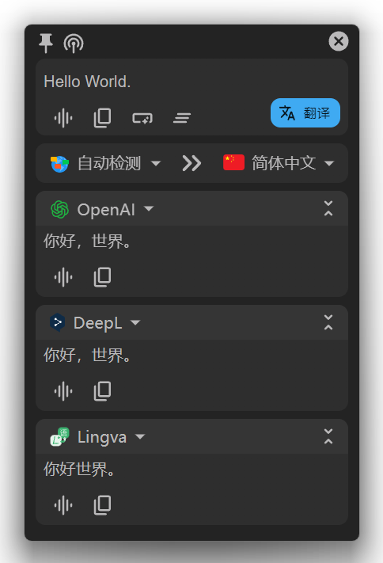
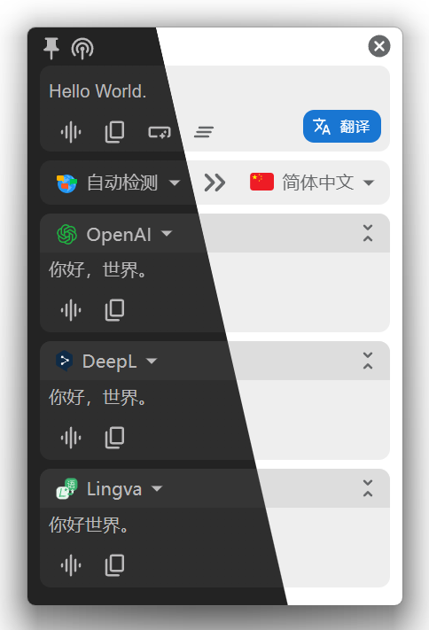
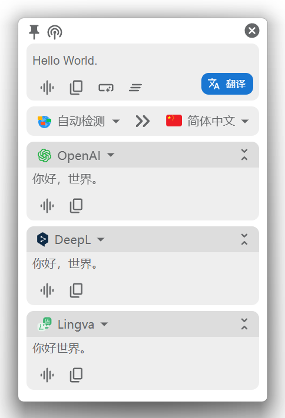
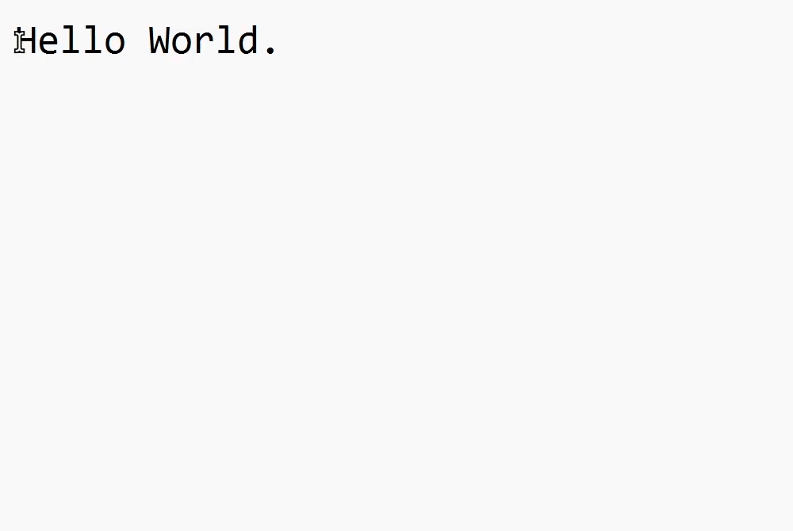
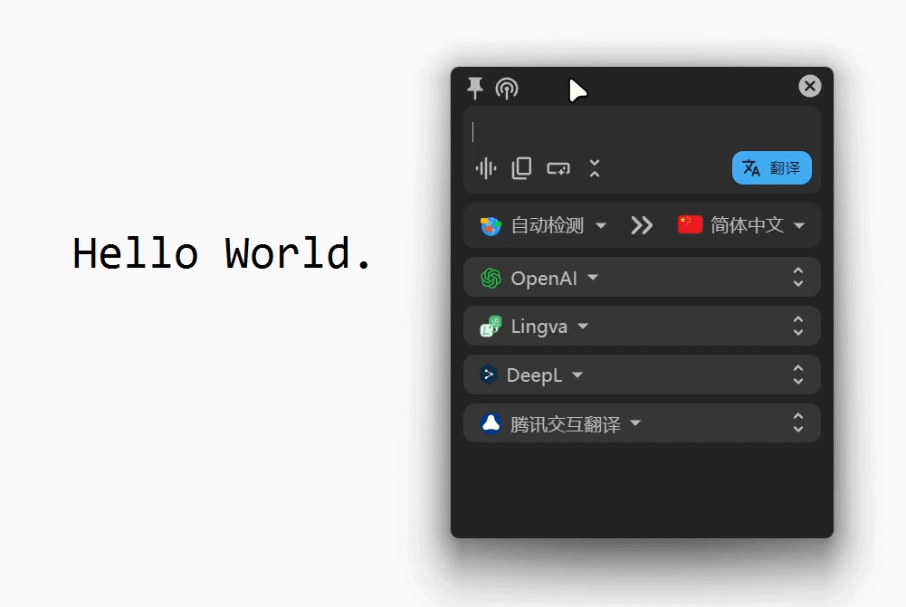
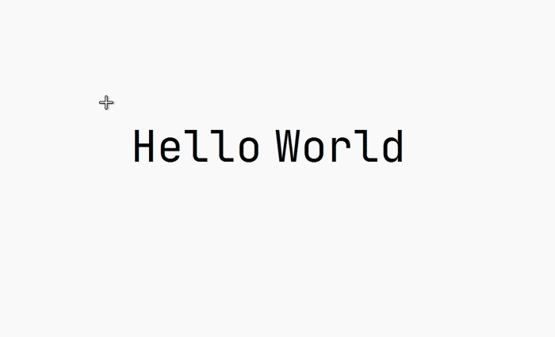
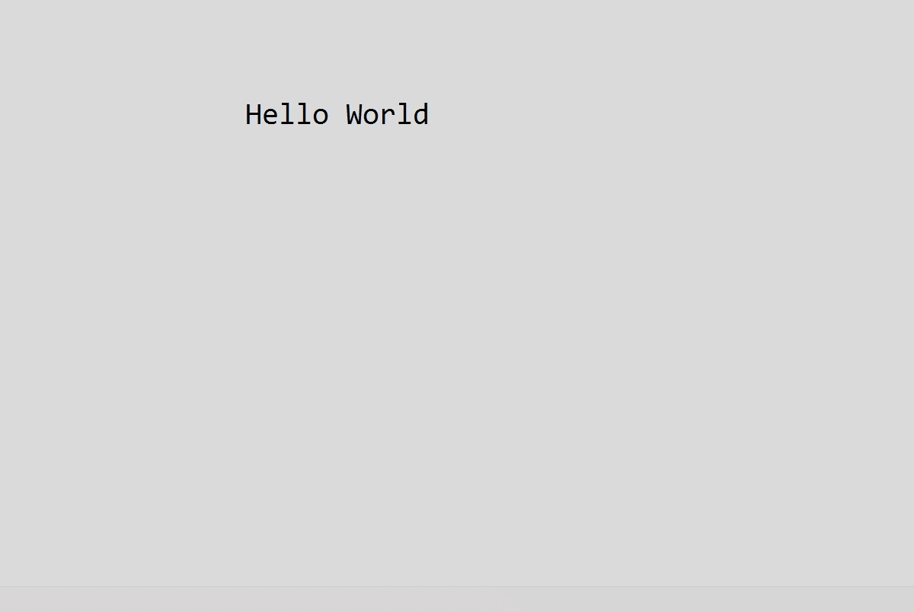

# Pot (A cute translator)

> A cross-platform translator application ([Telegram Group](https://t.me/pot_app))


<br/>
<hr/>
<div align="center">

<h3><a href='./README.md'>中文</a> | English | <a href='./README_KR.md'> 한글 </a></h3>

<table>
<tr>
    <td> 
    <td> 
    <td> 
</table>

# Table of Contents

</div>

-   [Usage](#usage)
-   [Features](#features)
-   [Supported Services](#supported-services)
-   [Plugin System](#plugin-system)
-   [Installation](#installation)
-   [External Calls](#external-calls)
-   [Wayland Support](#wayland-support)
-   [Internationalization](#internationalizationweblate)
-   [Contributors](#contributors)
-   [Thanks](#thanks)

<div align="center">

# Usage

</div>

| Translation by selection                        | Translate by input                                                    | External calls                                                                           |
| ----------------------------------------------- | --------------------------------------------------------------------- | ---------------------------------------------------------------------------------------- |
| Select text and press the shortcut to translate | Press shortcut to open translation window, translate by hitting Enter | More efficient workflow by integrating other apps, see [External Calls](#external-calls) |
|                       |                                             |                                                                |

| Clipboard Listening                                                                                                          | Screenshot OCR                     | Screenshot Translation                   |
| ---------------------------------------------------------------------------------------------------------------------------- | ---------------------------------- | ---------------------------------------- |
| Click the top left icon on any translation panel to start clipboard listening. Copied text will be translated automatically. | Press shortcut, select area to OCR | Press shortcut, select area to translate |
|                                                                                                    |          |                |

<div align="center">

# Features

</div>

-   [x] Parallel translations with multiple services ([Supported Services](#supported-services))
-   [x] OCR with multiple services ([Supported Services](#supported-services))
-   [x] Text-to-Speech with multiple services ([Supported Services](#supported-services))
-   [x] Export to vocabulary apps ([Supported Services](#supported-services))
-   [x] External calls ([External Calls](#external-calls))
-   [x] Plugin system ([Plugin System](#plugin-system))
-   [x] Support Windows, macOS and Linux
-   [x] Support Wayland (Tested on KDE, Gnome and Hyprland)
-   [x] Multi-language support

<div align="center">

# Supported Services

</div>

## Translation

-   [x] [OpenAI](https://platform.openai.com/)
-   [x] [ChatGLM](https://www.zhipuai.cn/)
-   [x] [Gemini Pro](https://gemini.google.com/)
-   [x] [Ollama](https://www.ollama.com/) (Offline)
-   [x] [Ali Translate](https://www.aliyun.com/product/ai/alimt)
-   [x] [Baidu Translate](https://fanyi.baidu.com/)
-   [x] [Caiyun](https://fanyi.caiyunapp.com/)
-   [x] [Tencent Transmart](https://fanyi.qq.com/)
-   [x] [Tencent Interactive Translate](https://transmart.qq.com/)
-   [x] [Volcengine Translate](https://translate.volcengine.com/)
-   [x] [NiuTrans](https://niutrans.com/)
-   [x] [Google Translate](https://translate.google.com)
-   [x] [Bing Translate](https://learn.microsoft.com/zh-cn/azure/cognitive-services/translator/)
-   [x] [Bing Dictionary](https://www.bing.com/dict)
-   [x] [DeepL](https://www.deepl.com/)
-   [x] [Youdao](https://ai.youdao.com/)
-   [x] [Cambridge Dictionary](https://dictionary.cambridge.org/)
-   [x] [Yandex](https://translate.yandex.com/)
-   [x] [Lingva](https://github.com/TheDavidDelta/lingva-translate) ([Plugin](https://github.com/pot-app/pot-app-translate-plugin-template))
-   [x] [Tatoeba](https://tatoeba.org/) ([Plugin](https://github.com/pot-app/pot-app-translate-plugin-tatoeba))
-   [x] [ECDICT](https://github.com/skywind3000/ECDICT) ([Plugin](https://github.com/pot-app/pot-app-translate-plugin-ecdict))

More Services see [Plugin System](#plugin-system)

## Text Recognize

-   [x] System OCR (Offline)
    -   [x] [Windows.Media.OCR](https://learn.microsoft.com/en-us/uwp/api/windows.media.ocr.ocrengine?view=winrt-22621) on Windows
    -   [x] [Apple Vision Framework](https://developer.apple.com/documentation/vision/recognizing_text_in_images) on MacOS
    -   [x] [Tesseract OCR](https://github.com/tesseract-ocr) on Linux
-   [x] [Tesseract.js](https://tesseract.projectnaptha.com/) (Offline)
-   [x] [Baidu](https://ai.baidu.com/tech/ocr/general)
-   [x] [Tencent](https://cloud.tencent.com/product/ocr-catalog)
-   [x] [Volcengine](https://www.volcengine.com/product/OCR)
-   [x] [iflytek](https://www.xfyun.cn/services/common-ocr)
-   [x] [Tencent Image Translate](https://cloud.tencent.com/document/product/551/17232)
-   [x] [Baidu Image Translate](https://fanyi-api.baidu.com/product/22)
-   [x] [Simple LaTeX](https://simpletex.cn/)
-   [x] [OCRSpace](https://ocr.space/) ([Plugin](https://github.com/pot-app/pot-app-recognize-plugin-template))
-   [x] [Rapid](https://github.com/RapidAI/RapidOcrOnnx) (Offline [Plugin](https://github.com/pot-app/pot-app-recognize-plugin-rapid))
-   [x] [Paddle](https://github.com/hiroi-sora/PaddleOCR-json) (Offline [Plugin](https://github.com/pot-app/pot-app-recognize-plugin-paddle))

More Services see [Plugin System](#plugin-system)

## Text-to-Speech

-   [x] [Lingva](https://github.com/thedaviddelta/lingva-translate)

More Services see [Plugin System](#plugin-system)

## Collection

-   [x] [Anki](https://apps.ankiweb.net/)
-   [x] [Eudic](https://dict.eudic.net/)
-   [x] [Youdao](https://www.youdao.com/) ([Plugin](https://github.com/pot-app/pot-app-collection-plugin-youdao))
-   [x] [ShanBay](https://web.shanbay.com/web/main) ([Plugin](https://github.com/pot-app/pot-app-collection-plugin-shanbay))

More Services see [Plugin System](#plugin-system)

<div align="center">

# Plugin System

</div>

The built-in services are limited. But you can expand the app's functionality through the plugin system.

## Install Plugin

You can find plugins you need in the [Plugin List](https://pot-app.com/plugin.html), and then go to the plugin repo to download it.

The file extension of pot plugin is `.potext`. After downloading the `.potext` file, go to Preferences - Service Settings - Add External Plugin - Install External Plugin to select the corresponding `.potext` to install it. It will then be added to the service list and can be used like a built-in service.

### Troubleshooting

-   The specified module could not be found (Windows)

    Errors like this occur because the system lacks C++ libraries，Go to [here](https://learn.microsoft.com/en-us/cpp/windows/latest-supported-vc-redist?view=msvc-170#visual-studio-2015-2017-2019-and-2022) download and install it.

-   Not a valid Win32 application (Windows)

    An error like this indicates that you did not download the plugin for the corresponding system or architecture. Go to the plugin repository and download the correct plugin to solve the problem.

## Develop Plugin

The [Template](https://pot-app.com/en/plugin.html#template) section in the [Plugin List](https://pot-app.com/en/plugin.html) provides plugin development templates for various plugins. Please check the corresponding template repo for specific documentation.

<div align="center">

# Installation

</div>

## Windows

### Install via Winget

```powershell
winget install Pylogmon.pot
```

### Install Manually

1. Download the installation package ending in `.exe` from the Latest [Release](https://github.com/pot-app/pot-desktop/releases/latest) page.

    - 64-bit machine download `pot_{version}_x64-setup.exe`
    - 32-bit machine download `pot_{version}_x86-setup.exe`
    - arm64 machine download `pot_{version}_arm64-setup.exe`

2. Double click the downloaded file to install it.

### 故障排除

-   There is no interface after startup, and there is no response when clicking the tray icon.

    Check if WebView2 is uninstalled/disabled, if so, install WebView2 manually or restore it.

    If the enterprise edition system is inconvenient to install or cannot install WebView2, please try to download the fix WebView2 version `pot_{version} at [Release](https://github.com/pot-app/pot-desktop/releases/latest) _{arch}_fix_webview2_runtime-setup.exe`

    If the issue persists, please try starting in Windows 7 compatibility mode.

## MacOS

### Install via Brew

1. Add our tap:

```bash
brew tap pot-app/homebrew-tap
```

2. Install pot:

```bash
brew install --cask pot
```

3. Upgrade pot

```bash
brew upgrade --cask pot
```

### Install Manually

1. Download the installation package ending in `.dmg` from the Latest [Release](https://github.com/pot-app/pot-desktop/releases/latest) page. (If you are using M1, please download the installation package named `pot_{version}_aarch64.dmg`, otherwise download the installation package named `pot_{version}_x64.dmg`)
2. Double click the downloaded file to install it.

### Troubleshooting

-   "pot" can’t be opened because the developer cannot be verified.

    Click the Cancel button, then go to the Settings -> Privacy and Security page, click the Still Open button, and then click the Open button in the pop-up window. After that, there will be no more pop-up warnings when opening pot.

    If you cannot find the above options in Privacy & Security, or get error prompts such as broken files with Apple Silicon machines. Open Terminal.app and enter the following command (you may need to enter a password halfway through), then restart pot:

    ```bash
    sudo xattr -d com.apple.quarantine /Applications/pot.app
    ```

-   If you encounter a permission prompt every time you open it, or if you cannot perform a shortcut translation, please go to Settings -> Privacy & Security -> Supporting Features to remove pot, and then re-add pot.

## Linux

### Debian/Ubuntu

We provide `deb` packages for Linux.

Please note that: There are two deb package, `universal` is based on `glibc2.28` and `openssl-1.1`, If the regular deb package can't run on your machine due to dependency problems, please download the `universal` package, Due to its low version dependency, it can run on most systems.

### Arch/Manjaro

> [!WARNING]  
> In newer version of [Webkit2Gtk](https://archlinux.org/packages/extra/x86_64/webkit2gtk) (2.42.0), Because Nvidia Proprietary drives are not fully implemented DMABUF, it will cause failure to start and crash.<br>
> Please downgrade or add the `WEBKIT_DISABLE_DMABUF_RENDERER=1` environment variable to `/etc/environment` (or other places where environment variables are set) to turn off the use of DMABUF.

1. View on [AUR](https://aur.archlinux.org/packages?O=0&K=pot-translation)

Use aur helper：

```bash
yay -S pot-translation # or pot-translation-bin or pot-translation-git
# or
paru -S pot-translation # or pot-translation-bin or pot-translation-git
```

2. If you are using `archlinuxcn`, you can install directly using pacman:

```bash
sudo pacman -S pot-translation
```

### Flatpak

> [!WARNING]
> The tray icon is missing in Flatpak version.

<a href='https://flathub.org/apps/com.pot_app.pot'>
    
</a>

<div align="center">

# External Calls

</div>

Pot provides a complete HTTP interface for integration with other software. You can call pot by sending HTTP requests to `127.0.0.1:port`, where `port` is the listening port of pot, default to `60828`, and can be changed in the app settings.

## API Docs:

```bash
POST "/" => Translate given text (body is text to translate)
GET "/config" => Open settings
POST "/translate" => Translate given text (same as "/")
GET "/selection_translate" => Translate selected text
GET "/input_translate" => Open input translation
GET "/ocr_recognize" => Perform OCR on screenshot
GET "/ocr_translate" => Perform translation on screenshot
GET "/ocr_recognize?screenshot=false" => OCR without taking screenshot
GET "/ocr_translate?screenshot=false" => Translate screenshot without taking screenshot
GET "/ocr_recognize?screenshot=true" => OCR with screenshot
GET "/ocr_translate?screenshot=true" => Translate screenshot
```

## Example:

-   Call translation by selection:

    To call pot's translation by selection, simply send a request to `127.0.0.1:port`:

    E.g. using curl:

    ```bash
    curl "127.0.0.1:60828/selection_translate"
    ```

## OCR without internal screenshot

This allows you to perform OCR/translation without using pot's internal screenshot, so you can use your own screenshot tools. It also solves the problem where pot's internal screenshot doesn't work on some platforms.

### Workflow:

1. Take screenshot using other tool
2. Save screenshot to `$CACHE/com.pot-app.desktop/pot_screenshot_cut.png`
3. Send request to `127.0.0.1:port/ocr_recognize?screenshot=false` to call

> `$CACHE` is the system cache dir, e.g. `C:\Users\{username}\AppData\Local\com.pot-app.desktop\pot_screenshot_cut.png` on Windows.

### Example

OCR using Flameshot on Linux:

```bash
rm ~/.cache/com.pot-app.desktop/pot_screenshot_cut.png && flameshot gui -s -p ~/.cache/com.pot-app.desktop/pot_screenshot_cut.png && curl "127.0.0.1:60828/ocr_recognize?screenshot=false"
```

## Existing Usages (Quick selection translation)

### SnipDo (Windows)

1. Download and install SnipDo in the [Microsoft Store](https://apps.microsoft.com/store/detail/snipdo/9NPZ2TVKJVT7)
2. Download the SnipDo extension of pot from the Latest [Release](https://github.com/pot-app/pot-desktop/releases/latest) (pot.pbar)
3. Double click the downloaded file to install it.
4. Selection some text, you can see the pot icon in the upper right corner of the selection, click the icon to translate.

### PopClip (MacOS)

1. Download and install PopClip in the [App Store](https://apps.apple.com/us/app/popclip/id445189367?mt=12)
2. Download the PopClip extension of pot from the Latest [Release](https://github.com/pot-app/pot-desktop/releases/latest) (pot.popclipextz)
3. Double click the downloaded file to install it.
4. Enable the pot extension in PopClip settings, and then you can translate by selecting text.

### Starry (Linux)

> Starry is still in the development stage, so you can only compile him manually

Github: [ccslykx/Starry](https://github.com/ccslykx/Starry)

<div align="center">

# Wayland Support

</div>

Due to the varying levels of support for Wayland among different distributions, pot itself cannot achieve perfect compatibility. However, here are some solutions to common issues that can be implemented through proper configuration, allowing pot to run flawlessly on Wayland.

## Shortcut key cannot be used

Due to Tauri's lack of support for Wayland, the shortcut key scheme in the pot application cannot be used under Wayland.
You can set the system shortcut and send a request with `curl` to call pot, see [External Calls](#external-calls) for details

## Screenshot doesn't work

In some pure Wayland desktop environments/window managers (such as Hyprland), the built-in screenshot feature of pot cannot be used. In this case, you can use other screenshot tools instead. For more details, please refer to the section [Not Using Built-in Screenshot](#not-using-built-in-screenshot).

### A configuration example for Hyprland using `grim` and `slurp` to achieve screenshot functionality:

```conf
bind = ALT, X, exec, grim -g "$(slurp)" ~/.cache/com.pot-app.desktop/pot_screenshot_cut.png && curl "127.0.0.1:60828/ocr_recognize?screenshot=false"
bind = ALT, C, exec, grim -g "$(slurp)" ~/.cache/com.pot-app.desktop/pot_screenshot_cut.png && curl "127.0.0.1:60828/ocr_translate?screenshot=false"
```

### A configuration example for KDE Plasma using `spectacle` to achieve screenshot functionality:

```shell
spectacle -bnr -o ~/.cache/com.pot-app.desktop/pot_screenshot_cut.png && curl "127.0.0.1:60828/ocr_recognize?screenshot=false"
```

Add a new shortcut in System Settings -> Input & Output -> Keyboard -> Shortcuts, input the following command and add a keybinding.

Other desktop environments/window managers also have similar operations.

## The translation window follows the mouse position.

Due to the current inability of pot to obtain accurate mouse coordinates under Wayland, its internal implementation cannot function properly.
For certain desktop environments/window managers, it is possible to achieve window following mouse position by setting window rules. Here we take Hyprland as an example:

```conf
windowrulev2 = float, class:(pot), title:(Translator|OCR|PopClip|Screenshot Translate) # Translation window floating
windowrulev2 = move cursor 0 0, class:(pot), title:(Translator|PopClip|Screenshot Translate) # Translation window follows the mouse position.
```

<div align="center">

# Internationalization([Weblate](https://hosted.weblate.org/engage/pot-app/))

[](https://hosted.weblate.org/engage/pot-app/)

[](https://hosted.weblate.org/engage/pot-app/)

</div>

<div align="center">

# Contributors

</div>


## Manual compilation

### Requirements

Node.js >= 18.0.0

pnpm >= 8.5.0

Rust >= 1.80.0

### Start compilation

1. Clone the repository

    ```bash
    git clone https://github.com/pot-app/pot-desktop.git
    ```

2. Install dependencies

    ```bash
    cd pot-desktop
    pnpm install
    ```

3. Install dependencies(Only Linux)

    ```bash
    sudo apt-get install -y libgtk-3-dev libwebkit2gtk-4.0-dev libayatana-appindicator3-dev librsvg2-dev patchelf libxdo-dev libxcb1 libxrandr2 libdbus-1-3
    ```

4. Development (Optional)

    ```bash
    pnpm tauri dev # Run the app in development mode
    ```

5. Build
    ```bash
    pnpm tauri build # Build into installation package
    ```

<div align="center">

# Acknowledgement

</div>

-   [Bob](https://github.com/ripperhe/Bob) Inspiration
-   [bob-plugin-openai-translator](https://github.com/yetone/bob-plugin-openai-translator) OpenAI API Reference
-   [@uiYzzi](https://github.com/uiYzzi) Implementation ideas
-   [@Lichenkass](https://github.com/Lichenkass) Maintaining the Deepin App Store.
-   [Tauri](https://github.com/tauri-apps/tauri) A user-friendly GUI framework.

<div align="center">
